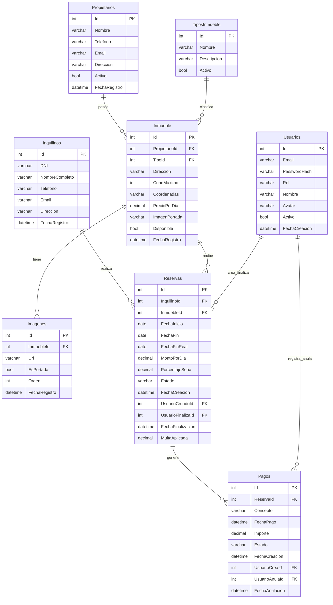

# 🏠 InmoDev - Sistema de Gestión de Alquileres Temporales 🏠

> InmoDev es un sistema integral de gestión para agencias inmobiliarias especializadas en alquileres temporales de propiedades. La plataforma digitaliza y optimiza todos los procesos operativos de la agencia, desde el registro de propiedades hasta la gestión completa de reservas y pagos.

---

## 👥 Integrantes del Grupo

* **Juan Esteban Carreras** - *carrerasjuanesteban@gmail.com* - [@usuario_github](https://github.com/CarrerasJuan) 
* **Federico Galan** - *federico.galan2023@gmail.com* - [@usuario_github](https://github.com/Federico-Galan) 

---

## 📐 Modelado de Datos

A continuación se presenta el esquema del modelo de datos correspondiente a la aplicación:

### Diagrama Entidad-Relación (DER) / Diagrama de Clases

Ver diagrama en código Mermaid 

