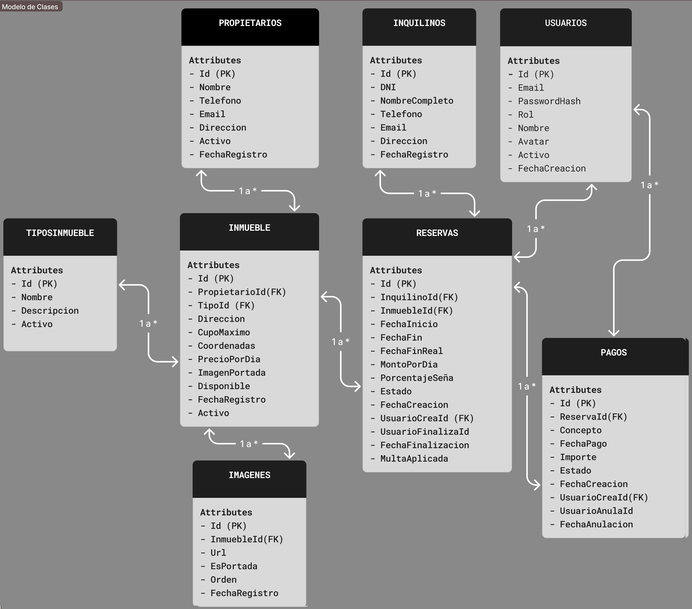

# InmoDev - Sistema de Gestion de Alquileres Temporales

InmoDev es un sistema web MVC para una agencia inmobiliaria que gestiona alquileres temporales de propiedades.

## Integrantes del grupo

- Juan Esteban Carreras - carrerasjuanesteban@gmail.com - https://github.com/CarrerasJuan
- Federico Galan - federico.galan2023@gmail.com - https://github.com/Federico-Galan

## Entregas

Primera entrega:

- Propietarios
- Inquilinos

Segunda entrega:

- Inmuebles
- Vista de fotos de inmuebles con carga AJAX de imagenes interiores

## Tecnologias

- ASP.NET Core MVC
- C#
- MySQL/MariaDB con XAMPP
- Bootstrap
- Font Awesome

## Base de datos

El script de creacion e inicializacion se encuentra en:

```text
scrypt.sql
```

### Configuracion esperada

El proyecto esta configurado para usar XAMPP/MariaDB con el usuario por defecto:

```text
Host: localhost
Puerto: 3306
Base de datos: SistemaInmobiliario
Usuario: root
Password: vacio
```

La cadena de conexion usada por la aplicacion es:

```json
"DefaultConnection": "Server=localhost;Port=3306;Database=SistemaInmobiliario;User=root;Password=;SslMode=None;"
```

Tambien se incluye un archivo `.env` con los mismos datos para que otros integrantes o QA puedan replicar el entorno local.

### Pasos para levantar el proyecto

1. Instalar .NET SDK 10.
2. Instalar XAMPP para Windows.
3. En XAMPP Control Panel, iniciar:
   - Apache
   - MySQL
4. Abrir phpMyAdmin desde:

```text
http://localhost/phpmyadmin/
```

5. Importar la base:
   - Entrar a la pestana `Importar`.
   - Seleccionar el archivo `scrypt.sql`.
   - Ejecutar la importacion.

6. Verificar que se haya creado la base:

```text
SistemaInmobiliario
```

7. Desde la carpeta del proyecto, restaurar/compilar:

```powershell
dotnet build
```

8. Ejecutar la aplicacion:

```powershell
dotnet run
```

9. Abrir la URL que indique la consola. Tambien se puede ejecutar con puerto fijo:

```powershell
dotnet run --urls http://localhost:5077
```

Y abrir:

```text
http://localhost:5077
```

### Alternativa por consola MySQL

Si se prefiere cargar el script desde terminal:

```powershell
cmd /c ""C:\xampp\mysql\bin\mysql.exe" -u root < "C:\ruta\al\proyecto\scrypt.sql""
```

Ejemplo usando esta carpeta:

```powershell
cmd /c ""C:\xampp\mysql\bin\mysql.exe" -u root < "C:\Users\carre\Laboratorio2\InmoDev\scrypt.sql""
```

Si el usuario o password de MySQL son distintos, modificar `appsettings.json` y `.env` antes de ejecutar la aplicacion.

## Diagrama Entidad-Relacion




