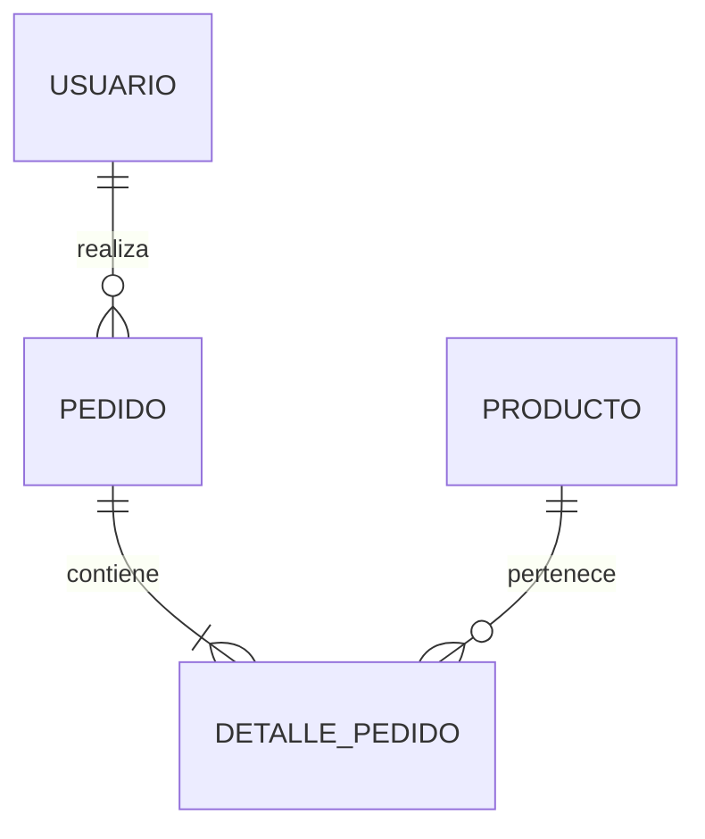

# Nombre del Proyecto

> Breve descripción del proyecto o una línea que resuma su propósito principal.

---

## 👥 Integrantes del Grupo

* **Nombre y Apellido** - *correo@ejemplo.com* - [@usuario_github](https://github.com/usuario) - Discord: `usuario_discord`
* **Nombre y Apellido** - *correo@ejemplo.com* - [@usuario_github](https://github.com/usuario) - Discord: `usuario_discord`
* **Nombre y Apellido** - *correo@ejemplo.com* - [@usuario_github](https://github.com/usuario) - Discord: `usuario_discord`

---

## 📐 Modelado de Datos

A continuación se presenta el esquema del modelo de datos correspondiente a la aplicación:

### Diagrama Entidad-Relación (DER) / Diagrama de Clases

> **Nota:** Puedes adjuntar la imagen en el repositorio (por ejemplo, en una carpeta `/docs` o `/img`) y enlazarla como se muestra arriba, o pegar directamente un diagrama generado en Mermaid.

Ver diagrama en código Mermaid (Opcional)

